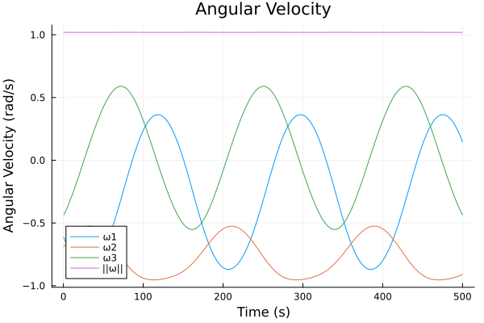
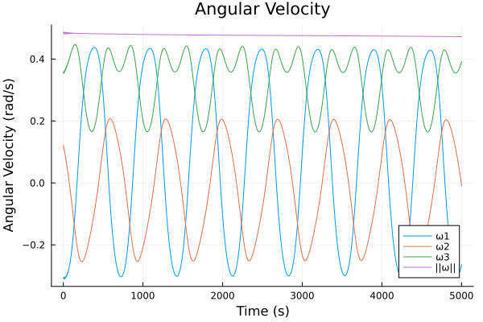
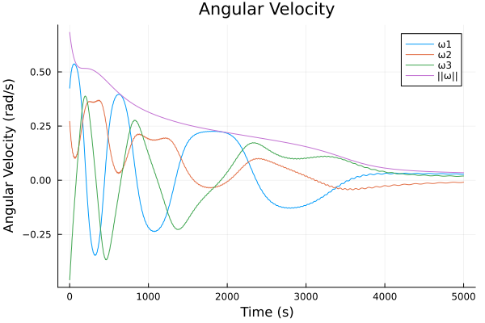

# SatellitePlayground.jl

SatellitePlayground.jl is made for testing Guidance, Navigation, and Control software for cubesats. It is both for software in the loop testing and for testing just the specific GNC software.

## Package Features
- Detailed satellite dynamics model including with the following perturbations
    - Attitude: gravity gradient, magnetic torque, solar radiation pressure, aerodynamic drag
    - Orbit: spherical harmonic gravity, atmospheric drag, solar radiation pressure, third body from the sun and moon
- Ability to easily turn on and off perturbations
- Simulation with thrusters, reaction wheel, or magnetic torquers for control
- Explicitly defined measurement functions for adding error models
- Testing of GNC software implementations
- Software in the loop testing via a shared memory interface provided by GNCTestClient.py + this package.

## Quick Start (Magnetorquer Detumbling Simulation Example)

In this example we'll write a simple detumbling test enviorment.
First install the `SatellitePlayground` package, for ease of use, we'll define `SP=SatellitePlayground`
```julia
using SatellitePlayground
SP = SatellitePlayground
```

To run a simulation with default parameters, one must supply a control function.
To start we'll make a `no_control` function.
By default `measurement` is a tuple of `(state, environment)`.

```julia
function no_control(measurement)
    return zero(SP.Control)
end
```

To run this simulation simply run
```julia
(hist, time) = SP.simulate(no_control)
```
Hist will contain an array of the state at each time step, and time will contain an array of the time at each time step.
We can plot the angular velocity over time with the following code.
```julia
using Plots
using LinearAlgebra # for norm
hist = [[state.angular_velocity; norm(state.angular_velocity)] for state in hist]
hist = SP.vec_to_mat(hist)
plot(time, hist, title="Angular Velocity", xlabel="Time (s)", ylabel="Angular Velocity (rad/s)", labels=["ω1" "ω2" "ω3" "||ω||"])
```

This will result in a plot that is close to, but not exactly cyclic.
This is because by default the simulation uses a model of the pycubed-mini satellite, with environmental perturbations enabled.


By default this simulation will run for 1000 iterations.
However, you change change this by setting `max_iterations`, or `terminal_condition`.

In our case we will set increase the number of maximum iterations to 10,000, and make the simulation terminate once the angular velocity drops below 0.01 radians.
```julia
function terminate(state::RBState, env::Environment, i::Int)
    return norm(state.angular_velocity) < 0.01
end
(hist, time) = SP.simulate(no_control, max_iterations=10_000, terminal_condition=terminate)
```

We will now use the b-cross controller to detumble the satellite.
```julia
function bcross_controller(measurement)
    (ω, b) = measurement

    b̂ = b / norm(b)
    k = 7e-4
    M = -k * (I(3) - b̂ * b̂') * ω
    m = 1 / (dot(b, b)) * cross(b, M)
    return SP.Control(
        m
    )
end
```
To demonstrate measurement functions (which are intended for adding error models), we will write a measurement function that returns a measurement of the form `(angular_velocity, b)`, rather than the default `(state, environment)`.
```julia
function measure(state, environment)
    return (state.angular_velocity, environment.b)
end
```

Finally, we will run the simulation with the new controller and measurement function. This simulation will run for 10,000 iterations, or until the angular velocity drops below 0.01 radians. 
```julia
(hist, time) = SP.simulate(bcross_controller, max_iterations=10_000, terminal_condition=terminate, measure=measure)
```

This produces a plot similar to the following, which shows the satellite very slowly detumbling. This is primarily due to control limits being taken into account.



We can remove the magnetic dipole limits via
```julia
no_limit_pqmini_model = copy(SP.pqmini_model)
no_limit_pqmini_model.control_limit = [Inf, Inf, Inf]
(hist, time) = SP.simulate(bcross_controller, max_iterations=10_000, terminal_condition=terminate, measure=measure, model=no_limit_pqmini_model)
```

This produces results similar to the following, which shows the satellite detumbling much faster, yet still exhibits some oscillations caused by perturbations.



We can run the simulations withouth pertubations on attitude via
```julia
env = copy(SP.default_environment)
env.config = SP.EnvironmentConfig(
    include_drag=false,
    include_solar_radiation_pressure=false,
    include_gravity_gradient_torque=false
)
(hist, time) = SP.simulate(bcross_controller, max_iterations=10_000, terminal_condition=terminate, 
    measure=measure, model=no_limit_pqmini_model, environment=env)
```

This should produce results similar to the following


