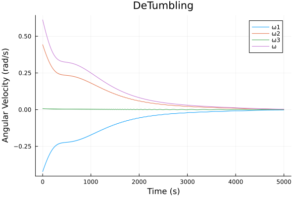
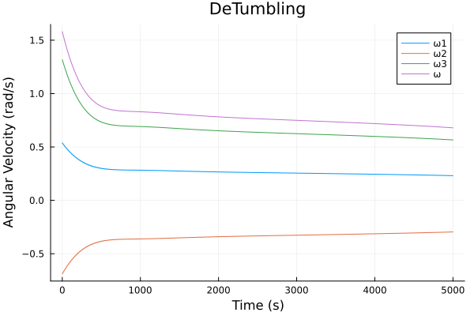
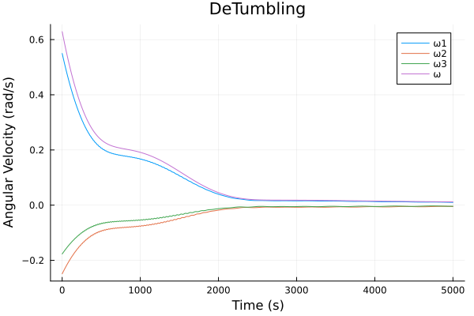

# SatellitePlayground.jl

## Package Features
- Satelite dynamics, with magnetorquers
- Software in the loop testing via the GNCTestClient
- Explicit control functions

## Quick Start (Detumbling Simulation Example)

In this example we'll write a simple detumbling test enviorment.
First install the `SatellitePlayground` package, for ease of use, we'll define `SP=SatellitePlayground`
```julia
using SatellitePlayground
SP = SatellitePlayground
```
To run a simulation with default parameters, one must supply a control function.
To start we'll make a `no_control` function.
By default `measurement` is a tuple of `(state, parameters)`.

```julia
function no_control(measurement)
    return zero(SP.Control)
end
```

To run this simulation simply run
```julia
(hist, time) = SP.simulate(no_control)
```
By default this simulation will log the angular velocity and its magnitude, and the coresponding times.
Hist will contain a vector of vectors containing `[angular_velocity; norm(angular_velocity)]`
To plot this data you can run the following, the vec_2_mat is required to make Plots happy.
```julia
using Plots
hist = SP.vec_to_mat(hist)
plot(time, hist, title="Angular Velocity", xlabel="Time (s)", ylabel="Angular Velocity (rad/s)", labels=["ω1" "ω2" "ω3" "||ω||"])
```
By default this simulation will run for 1000 iterations.
However, you change change this by setting `max_iterations`, or `terminal_condition`.

In our case we will set increase the number of maximum iterations to 10,000, and make the simulation terminate once the angular velocity drops below 0.01 radians.
```julia
using LinearAlgebra # for norm
function terminate(state, params, time, i)
    return norm(state.angular_velocity) < 0.01
end
(hist, time) = SP.simulate(no_control, max_iterations=10_000, terminal_condition=terminate)
```

We will now use the b-cross controller to detumble the satellite.
```julia
function bcross_controller(measurement)
    (ω, b) = measurement

    b̂ = b / norm(b)
    k = 7e-4
    M = -k * (I(3) - b̂ * b̂') * ω
    m = 1 / (dot(b, b)) * cross(b, M)
    return SP.Control(
        m
    )
end
```
To demonstrate measurement functions (which are intended for adding error models), we will write a measurement function that returns a measurement of the form `(angular_velocity, b)`, rather than the default `(state, parameters)`.
```julia
function measure(state, params, time)
    return (state.angular_velocity, params.b)
end
```

Finally, we will run the simulation with the new controller and measurement function.
```julia
(hist, time) = SP.simulate(bcross_controller, max_iterations=10_000, terminal_condition=terminate, measure=measure)
```

This simulation will run for 10,000 iterations, or until the angular velocity drops below 0.01 radians. A few examples of the results are shown below.


